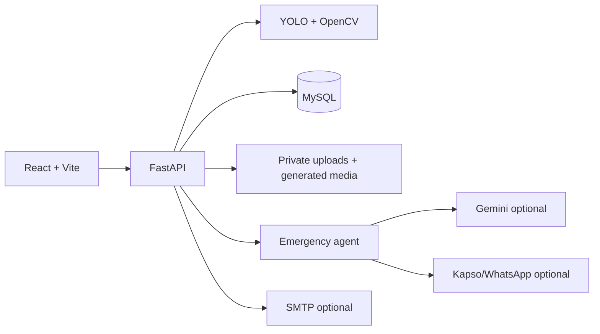
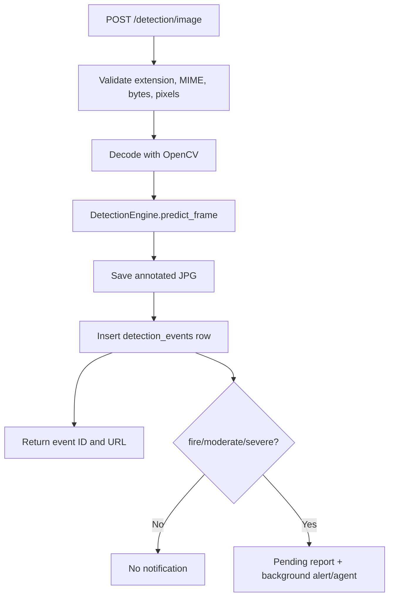

# Complete system details

This document explains the implementation in the order a request travels through the system: browser → API → inference → persistence → notifications → UI. Read the root [README.md](../README.md) first for setup. For directory ownership, storage boundaries, Docker volumes, and file lifecycles, see [File-system design](file-system-design.md).

## 1. System at a glance



Docker Compose runs three services:

| Service | Implementation | Responsibility |
| --- | --- | --- |
| `frontend` | React/Vite built and served by Nginx | Browser UI on port 80 |
| `backend` | FastAPI/Uvicorn | Auth, inference orchestration, API, alerts |
| `mysql` | MySQL 8 | Users, incidents, reports, logs |

The backend also mounts model weights and persistent media volumes.

## 2. Frontend implementation

The frontend is in `frontend/src` and uses React 18, React Router, Axios, Tailwind CSS, Heroicons, Framer Motion, Recharts, and react-hot-toast.

### Application shell

- `main.jsx` mounts the React application and authentication provider.
- `App.jsx` defines public routes and the authenticated `AppLayout`.
- `Navbar` and `Sidebar` wrap signed-in pages.
- `AuthContext.jsx` owns login/logout state, the current user, JWT token, and admin/operator helpers.
- `axiosClient.js` is the shared HTTP client. API modules in `src/api` call it rather than creating ad-hoc clients.

### Routes

| URL | Page | Access |
| --- | --- | --- |
| `/` | Landing | Public |
| `/login` | Login | Public |
| `/dashboard` | Overview statistics | Authenticated |
| `/detect/image` | Image upload and result | Authenticated |
| `/detect/video` | Video upload and progress | Authenticated |
| `/history` | Detection history/details | Authenticated |
| `/alerts` | Alert and agent report center | Authenticated |
| `/analytics` | Charts and trends | Authenticated |
| `/settings` | User settings | Authenticated |
| `/users` | User administration | Admin only |

### Frontend request flow

1. A page collects a file and optional location.
2. `detectionApi.js` creates `FormData` and sends the request.
3. The API response is rendered immediately for images or used as a video job ID.
4. Video pages poll `getVideoJob` until `completed` or `failed`.
5. Alert-worthy results call `pollAgentReport` until the pending report becomes available.
6. Shared components show severity, confidence, progress, delivery state, and errors.

## 3. Backend startup and request structure

The backend is in `backend/app`.

### Startup

`main.py`:

1. Loads settings from `backend/.env` and environment variables.
2. Creates storage directories.
3. Creates ORM tables if missing and initializes the singleton `DetectionEngine`.
4. Adds CORS, trusted-host, security-header, and static-file middleware.
5. Registers route groups under `/auth`, `/detection`, `/alerts`, `/dashboard`, `/users`, and `/agent`.
6. Exposes `GET /health` and optional Swagger/ReDoc documentation.

### Layer responsibilities

| Layer | Location | Responsibility |
| --- | --- | --- |
| Routes | `app/api/routes` | Parse requests, inject dependencies, authorize, return responses |
| Dependencies | `app/api/deps.py` | Decode JWTs, load active users, enforce admin role |
| Schemas | `app/schemas` | Validate and describe request/response data |
| Core services | `app/core` | Inference, video, alerts, reports, external services |
| Data access | `app/db/crud.py` | Query and mutate persistent records |
| Models | `app/db/models.py` | SQLAlchemy table and relationship definitions |
| Configuration | `app/config.py` | Typed environment settings and safe defaults |

## 4. Authentication and authorization

```mermaid
sequenceDiagram
    actor User
    participant UI as React
    participant Auth as /auth
    participant DB as MySQL
    User->>UI: Enter username and password
    UI->>Auth: POST /auth/login
    Auth->>DB: Find user
    Auth->>Auth: Verify bcrypt password; sign JWT
    Auth-->>UI: access_token + user
    UI->>UI: Store token for current session
    UI->>Auth: Authenticated API request
    Auth->>Auth: Decode token and load active user
```

Endpoints:

- `POST /auth/register`
- `POST /auth/login`
- `GET /auth/me`

Roles are `admin`, `operator`, and `viewer`. Non-admin event queries are scoped to the requesting user's ID. Admins can view all events, manage users, test notifications, and delete events. The frontend hides admin routes, but backend checks are the real security boundary.

## 5. Image detection implementation



Implementation details:

1. `detection.py` validates JPG/JPEG/PNG/WebP and configured size/pixel limits.
2. OpenCV decodes the request bytes; corrupt or oversized images are rejected.
3. `DetectionEngine` runs the singleton Ultralytics YOLO model with configured confidence, IoU, and image size.
4. Each box becomes a JSON object with class, confidence, and coordinates.
5. OpenCV draws the annotation and the result is written to `static/processed`.
6. `crud.create_detection_event` stores the event.
7. The API returns `event_id`, class, confidence, boxes, processed URL, processing time, and whether alert work was triggered.

If the model is absent or cannot run, the engine returns `no_detection` with an unannotated frame rather than crashing startup.

## 6. Video detection implementation

1. `POST /detection/video` validates MP4/AVI/MOV/MKV.
2. The upload is streamed to `data/uploads` with a byte limit.
3. OpenCV probes the container before a job is created.
4. `video_jobs.create_job` stores an in-memory job record and the endpoint returns a job ID.
5. A FastAPI background task calls `VideoProcessor.process`.
6. The processor samples frames using `VIDEO_FRAME_STRIDE`, runs the same model, writes an annotated MP4, and keeps the best-confidence snapshot.
7. An alert requires `VIDEO_CONFIRMATION_FRAMES` consecutive alert-worthy sampled frames.
8. The job writes a detection event and video-processing log, then becomes `completed`.

Polling endpoint:

```text
GET /detection/video/jobs/{job_id}
→ queued | processing | completed | failed
→ progress, processed_frames, total_frames, result, error
```

The optional `/stream` endpoint exposes an MJPEG preview. It currently checks job existence but needs the same JWT/ownership check as the polling endpoint before production deployment.

## 7. Model and training artifacts

Runtime inference is implemented in `backend/app/core/detection_engine.py`; video orchestration is in `video_processor.py`. The deployed weights are `backend/ml_model/best.pt`. Training notebooks, metrics, sample predictions, and training outputs are under `ml_training/accident_model_bundle`.

The contract is:

| Class ID | Name | Alert |
| ---: | --- | --- |
| 0 | fire | Yes |
| 1 | moderate | Yes |
| 2 | severe | Yes |
| — | no_detection | No |

Important settings include `MODEL_PATH`, `DETECTION_CONFIDENCE`, `IOU_THRESHOLD`, `IMG_SIZE`, `VIDEO_FRAME_STRIDE`, `VIDEO_CONFIRMATION_FRAMES`, and `MAX_VIDEO_FRAMES`.

## 8. Database and persistence

The ORM is authoritative for runtime behavior. `database/init.sql` initializes a new MySQL instance; Alembic migrations in `backend/alembic/versions` upgrade existing installations.

| Table | Purpose |
| --- | --- |
| `users` | Accounts, bcrypt hashes, roles, active state |
| `detection_events` | One image/video incident record |
| `alerts` | SMTP attempt and delivery status |
| `call_logs` | Local/mock call audit record |
| `video_processing_logs` | Frame counts, class counts, FPS, output |
| `agent_reports` | Assessment, PDF path, WhatsApp outcome |
| `audit_log` | Append-only system/operator actions |

An event owns optional alert, call, video, and agent-report records. Media is stored by path rather than as database blobs.

## 9. Emergency agent, reports, and notifications

Alert-worthy events trigger background work:

1. A pending `agent_reports` record is created.
2. `emergency_agent.py` builds context and requests Gemini when `GEMINI_API_KEY` exists.
3. Without Gemini, or after an LLM failure, a deterministic rule-based report is produced.
4. `report_generator.py` creates an incident PDF in `static/reports`.
5. `alert_service.py` sends an SMTP email when all SMTP values exist; otherwise it records a skipped outcome.
6. `whatsapp_service.py` uses mock mode by default or Kapso when configured.
7. The report and audit log are updated with model, timing, delivery IDs, and errors.

Agent endpoints:

- `GET /agent/status`
- `GET /agent/report/{detection_id}`
- `GET /agent/report/{detection_id}/pdf`
- `GET /agent/reports`
- `POST /agent/test-whatsapp` (admin)

Alert endpoints:

- `GET /alerts`
- `GET /alerts/calls`
- `POST /alerts/test-email` (admin)
- `POST /alerts/test-call` (admin/mock)

Missing integration credentials should produce a visible skipped/fallback state, not a false claim of delivery.

## 10. Dashboard API

- `GET /dashboard/stats` provides headline totals.
- `GET /dashboard/timeline` provides time-based event data.
- `GET /dashboard/confidence-distribution` provides confidence buckets.
- `GET /detection/history` and `GET /detection/history/{id}` provide owner-scoped event data.
- `PATCH /detection/history/{id}/status` changes incident state.
- `DELETE /detection/history/{id}` is admin-only.
- `GET /users`, `PUT /users/{id}`, and `DELETE /users/{id}` are admin-only.

## 11. Storage and URLs

| Location | Public? | Contents |
| --- | --- | --- |
| `data/uploads` | No | Original uploaded videos |
| `static/processed` | Yes through `/static` | Annotated images and videos |
| `static/snapshots` | Yes through `/static` | Best video frames |
| `static/reports` | Yes through `/static` | Generated incident PDFs/images |

The API stores paths in MySQL and returns URLs for generated artifacts. Review retention and access policy before a public deployment.

## 12. Configuration

Core settings are defined in `backend/app/config.py`. Main groups:

- Database/security: `DATABASE_URL`, `SECRET_KEY`, `ALGORITHM`, token expiry, CORS, trusted hosts.
- Model: `MODEL_PATH`, confidence, IoU, image size.
- Video/files: upload directory, processed directories, upload/pixel/frame limits, accepted types.
- Email: `SMTP_HOST`, `SMTP_PORT`, `SMTP_USER`, `SMTP_PASSWORD`, `ALERT_EMAIL_TO`.
- Agent: `GEMINI_API_KEY`, `GEMINI_MODEL`, `AGENT_ENABLED`, timeout.
- WhatsApp: `WHATSAPP_MODE`, `WHATSAPP_ENABLED`, Kapso IDs/keys, media URL settings.

Compose supplies database credentials and deployment overrides; `backend/.env` supplies application/integration values. Keep these files separate.

## 13. Testing and development workflow

Backend tests use an isolated SQLite database and disable the external agent:

```bash
cd backend
pytest -q
```

Frontend checks:

```bash
cd frontend
npm run lint
npm run build
```

For a backend change, inspect the route, core service, CRUD/model code, and relevant tests together. For a schema change, update the ORM, add an Alembic migration, and assess `database/init.sql`. For a model change, verify class order and regression samples.

## 14. Known limitations and next production steps

- Video jobs are process-local and not durable across restarts; use a durable worker/queue for multi-worker deployment.
- The video MJPEG stream needs JWT and ownership checks.
- Generated media needs explicit retention/deletion policy.
- Live emergency delivery requires a security, privacy, HTTPS, recipient-consent, and provider-policy review.
- Model quality depends on the training data and should be measured with repeatable regression/evaluation samples.
- Frontend session restoration and production cookie/token policy should be reviewed before deployment.
