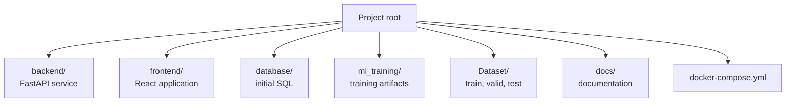
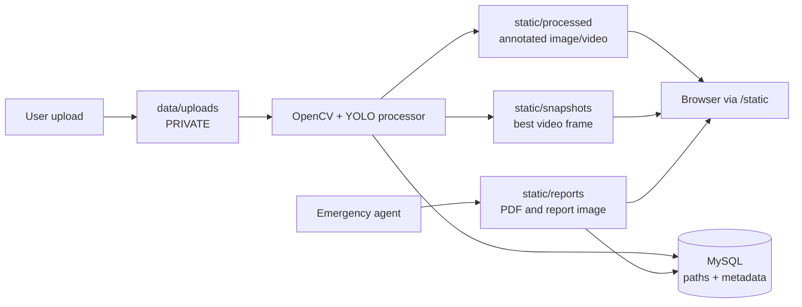
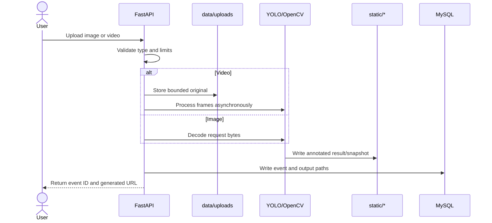

# File-system design

This document explains where source code, model artifacts, runtime uploads, generated results, and persistent database data belong. The key rule is simple: **source and model files are versioned; user media and secrets are runtime data and must stay out of Git.**

## Repository map



| Path | Type | Purpose | Version-control rule |
| --- | --- | --- | --- |
| `backend/app/` | Source | API routes, services, ORM, schemas, configuration | Commit |
| `backend/alembic/` | Source | Incremental database migrations | Commit |
| `backend/ml_model/` | Runtime model | `best.pt` and class metadata used by the API | Commit only approved model artifacts |
| `backend/tests/` | Tests | API, security, alert, and workflow tests | Commit |
| `frontend/src/` | Source | React pages, components, API clients, auth state | Commit |
| `database/` | Database bootstrap | `init.sql` and safe seed script | Commit; never put secrets in SQL |
| `ml_training/` | ML research | Notebook, metrics, sample predictions, training output | Commit useful reproducible artifacts |
| `Dataset/` | ML data | Training/validation/test data | Follow dataset licensing and size policy |
| `docs/` | Documentation | This file and the complete system guide | Commit |
| `docker-compose.yml` | Deployment | Local service topology, mounts, environment wiring | Commit |

## Runtime storage boundaries



### Private storage

`data/uploads/` contains original uploaded videos. It is mounted as `/app/data` in Docker and is deliberately outside FastAPI's `/static` mount. Do not expose it through Nginx or add it to a public object-storage bucket without an access policy.

### Generated storage

The following directories are served by FastAPI under `/static`:

- `static/processed/`: annotated image JPGs and processed MP4 videos.
- `static/snapshots/`: highest-confidence video frames used as evidence.
- `static/reports/`: generated incident PDFs and report images.

These files are safe-to-serve application artifacts, but they can still contain sensitive incident information. Retention, authentication, and deletion policy should be added before public deployment.

### Database storage

MySQL stores metadata and relationships, not media blobs:

```text
users
  └── detection_events
        ├── alerts
        ├── call_logs
        ├── video_processing_logs
        ├── agent_reports
        └── audit_log
```

Each event stores paths such as `processed_filename`, `snapshot_path`, and `report_path`. If a file is moved, its database path must be updated or the UI will show a broken artifact link.

## File lifecycle



## Docker volumes and mounts

| Compose mount | Container path | Reason |
| --- | --- | --- |
| `mysql_data` | `/var/lib/mysql` | Durable database data |
| `media_data` | `/app/static` | Generated images, videos, reports |
| `upload_data` | `/app/data` | Private original uploads |
| `./backend/ml_model` | `/app/ml_model` | Runtime model weights from host |
| `./database/init.sql` | MySQL init directory | First database bootstrap |
| `./database/seed.sql` | MySQL init directory | Safe empty/demo seed script |

`docker compose down` keeps named volumes. `docker compose down -v` removes database and media volumes and is destructive to local runtime data.

## What must never be committed

- Root `.env` and `backend/.env`
- Passwords, JWT secrets, SMTP app passwords, Gemini/Kapso keys
- Real emergency phone numbers or recipient addresses
- Unreviewed personal incident media
- Temporary uploads and generated runtime files
- Python virtual environments, `node_modules`, caches, and local build output

The `.gitignore` file is the first line of defense, but always check `git status` before committing.

## Adding a new file or directory

1. Decide whether it is source, a migration, a model artifact, runtime data, or documentation.
2. Put it under the matching boundary above; do not place uploads beside source files.
3. If it is runtime data, add/confirm its ignore rule and Docker volume behavior.
4. If it is a persisted artifact, add the database path field and cleanup policy.
5. Update `docs/SYSTEM_DETAILS.md` and this file when the storage contract changes.

See [SYSTEM_DETAILS.md](SYSTEM_DETAILS.md) for the full application execution flow.
