# Accident Detection & Emergency Response System

### Complete System Guide — architecture, file system, request flow, data, and operations

> [!IMPORTANT]
> **The golden rule of this project:** source code and approved model files are **versioned**; user media, generated runtime files, and secrets are **runtime data** and must **never** enter Git.

This is the single reference document for the whole project. It follows a request from the **browser → API → inference → persistence → notifications → UI**, and also explains where every file lives and why. For installation and first-run steps, read the root [README.md](../README.md) first.

> [!TIP]
> All diagrams are written in [Mermaid](https://mermaid.js.org/). They render automatically on GitHub, GitLab, Obsidian, and in VS Code (with a Mermaid preview extension).

---

## Quick facts

| | |
| --- | --- |
| **Purpose** | Detect fire and vehicle-accident severity in images and videos, record incidents, and notify responders |
| **Detection classes** | `fire`, `moderate`, `severe` (plus `no_detection`) |
| **Frontend** | React 18 + Vite, served by Nginx on port 80 |
| **Backend** | FastAPI on Uvicorn |
| **AI engine** | Ultralytics YOLO (`best.pt`) + OpenCV |
| **Database** | MySQL 8 (metadata only — no media blobs) |
| **Notifications** | SMTP email, Gemini-assisted report, WhatsApp via Kapso (all optional) |
| **Deployment** | Docker Compose — 3 services, 3 named volumes |
| **Roles** | `admin`, `operator`, `viewer` |

---

## Table of contents

1. [System at a glance](#1-system-at-a-glance)
2. [End-to-end request journey](#2-end-to-end-request-journey)
3. [Repository and file-system design](#3-repository-and-file-system-design)
4. [Runtime storage boundaries](#4-runtime-storage-boundaries)
5. [Frontend implementation](#5-frontend-implementation)
6. [Backend startup and structure](#6-backend-startup-and-structure)
7. [Authentication and authorization](#7-authentication-and-authorization)
8. [Image detection](#8-image-detection)
9. [Video detection](#9-video-detection)
10. [Model and training artifacts](#10-model-and-training-artifacts)
11. [Database and persistence](#11-database-and-persistence)
12. [Emergency agent, reports, and notifications](#12-emergency-agent-reports-and-notifications)
13. [API reference](#13-api-reference)
14. [Docker deployment, volumes, and mounts](#14-docker-deployment-volumes-and-mounts)
15. [Configuration](#15-configuration)
16. [Security and what must never be committed](#16-security-and-what-must-never-be-committed)
17. [Testing and development workflow](#17-testing-and-development-workflow)
18. [Adding a new file or directory](#18-adding-a-new-file-or-directory)
19. [Known limitations and production roadmap](#19-known-limitations-and-production-roadmap)
20. [Glossary](#20-glossary)

---

## 1. System at a glance

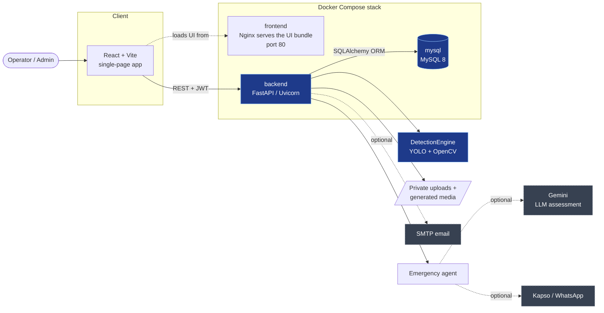

### Services

| Service | Implementation | Responsibility |
| --- | --- | --- |
| `frontend` | React/Vite, built and served by Nginx | Browser UI on port 80 |
| `backend` | FastAPI / Uvicorn | Authentication, inference orchestration, API, alerts |
| `mysql` | MySQL 8 | Users, incidents, reports, logs |

The backend additionally mounts the model weights and persistent media volumes (see [section 14](#14-docker-deployment-volumes-and-mounts)).

### Technology stack

| Layer | Technologies |
| --- | --- |
| **Frontend** | React 18, Vite, React Router, Axios, Tailwind CSS, Heroicons, Framer Motion, Recharts, react-hot-toast |
| **Backend** | FastAPI, Uvicorn, SQLAlchemy ORM, Alembic migrations, JWT auth, bcrypt |
| **AI / vision** | Ultralytics YOLO, OpenCV |
| **Data** | MySQL 8 (production), SQLite (tests only) |
| **Integrations** | Gemini (optional), Kapso/WhatsApp (optional), SMTP (optional) |
| **Infrastructure** | Docker, Docker Compose, Nginx |

---

## 2. End-to-end request journey

The diagram below shows the full life of a single upload that turns out to be alert-worthy.

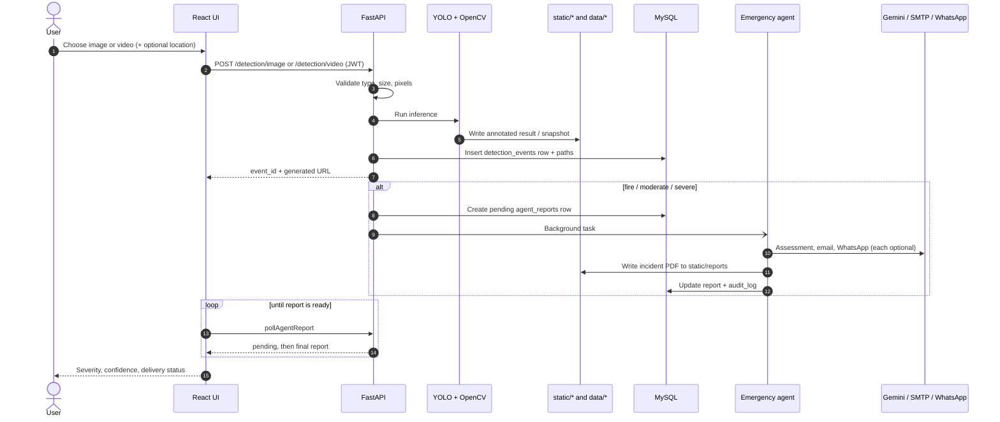

---

## 3. Repository and file-system design

### Repository map

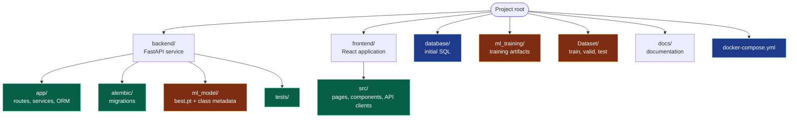

### Directory tree

```text
project-root/
├── backend/
│   ├── app/
│   │   ├── api/
│   │   │   ├── routes/              # auth, detection, alerts, dashboard, users, agent
│   │   │   └── deps.py              # JWT decoding, active user, admin guard
│   │   ├── core/                    # detection_engine, video_processor, emergency_agent,
│   │   │                            # report_generator, alert_service, whatsapp_service
│   │   ├── db/
│   │   │   ├── models.py            # SQLAlchemy tables and relationships
│   │   │   └── crud.py              # queries and mutations
│   │   ├── schemas/                 # request / response validation
│   │   ├── config.py                # typed environment settings
│   │   └── main.py                  # application startup
│   ├── alembic/versions/            # incremental DB migrations
│   ├── ml_model/                    # best.pt + class metadata
│   └── tests/                       # API, security, alert, workflow tests
├── frontend/
│   └── src/
│       ├── api/                     # detectionApi.js, axiosClient.js, ...
│       ├── components/              # Navbar, Sidebar, shared widgets
│       ├── pages/                   # Landing, Login, Dashboard, Detect, ...
│       ├── AuthContext.jsx          # login state, token, role helpers
│       ├── App.jsx                  # routes + AppLayout
│       └── main.jsx                 # React entry point
├── database/
│   ├── init.sql                     # first-time schema bootstrap
│   └── seed.sql                     # safe empty/demo seed
├── ml_training/
│   └── accident_model_bundle/       # notebook, metrics, sample predictions
├── Dataset/                         # train / valid / test
├── docs/
│   └── system.md                    # this document
└── docker-compose.yml

# Runtime directories (created at startup, NOT committed)
data/uploads/                        # private original videos      → /app/data
static/processed/                    # annotated images and videos  → /app/static
static/snapshots/                    # best video frames            → /app/static
static/reports/                      # incident PDFs and images     → /app/static
```

### Ownership and version-control rules

| Path | Type | Purpose | Version-control rule |
| --- | --- | --- | --- |
| `backend/app/` | Source | API routes, services, ORM, schemas, configuration | ✅ Commit |
| `backend/alembic/` | Source | Incremental database migrations | ✅ Commit |
| `backend/ml_model/` | Runtime model | `best.pt` and class metadata used by the API | ⚠️ Commit **only approved** model artifacts |
| `backend/tests/` | Tests | API, security, alert, and workflow tests | ✅ Commit |
| `frontend/src/` | Source | React pages, components, API clients, auth state | ✅ Commit |
| `database/` | Database bootstrap | `init.sql` and safe seed script | ✅ Commit; **never** put secrets in SQL |
| `ml_training/` | ML research | Notebook, metrics, sample predictions, training output | ✅ Commit useful, reproducible artifacts |
| `Dataset/` | ML data | Training / validation / test data | ⚠️ Follow dataset licensing and size policy |
| `docs/` | Documentation | This file | ✅ Commit |
| `docker-compose.yml` | Deployment | Service topology, mounts, environment wiring | ✅ Commit |
| `data/`, `static/` | Runtime data | Uploads and generated output | ❌ Never commit |
| `.env`, `backend/.env` | Secrets | Credentials and integration keys | ❌ Never commit |

---

## 4. Runtime storage boundaries

### Where files flow

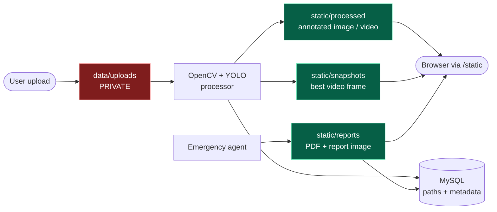

### Access at a glance

| Location | Public? | Contents | Docker path |
| --- | --- | --- | --- |
| `data/uploads/` | 🔒 **No** | Original uploaded videos | `/app/data` |
| `static/processed/` | 🌐 Yes, via `/static` | Annotated JPG images and processed MP4 videos | `/app/static` |
| `static/snapshots/` | 🌐 Yes, via `/static` | Highest-confidence video frames used as evidence | `/app/static` |
| `static/reports/` | 🌐 Yes, via `/static` | Generated incident PDFs and report images | `/app/static` |

### Private storage

`data/uploads/` holds the **original uploaded videos**. It is mounted as `/app/data` in Docker and is deliberately **outside** FastAPI's `/static` mount.

> [!WARNING]
> Do not expose `data/uploads/` through Nginx, and do not place it in a public object-storage bucket without an access policy.

### Generated storage

The directories under `static/` are served by FastAPI at `/static`. They are safe-to-serve application artifacts, **but they can still contain sensitive incident information**. Retention, authentication, and deletion policy should be added before any public deployment.

### Database storage

MySQL stores **metadata and relationships**, not media blobs. Each event stores paths such as `processed_filename`, `snapshot_path`, and `report_path`.

> [!NOTE]
> If a file is moved, its database path must be updated too — otherwise the UI shows a broken artifact link.

### File lifecycle

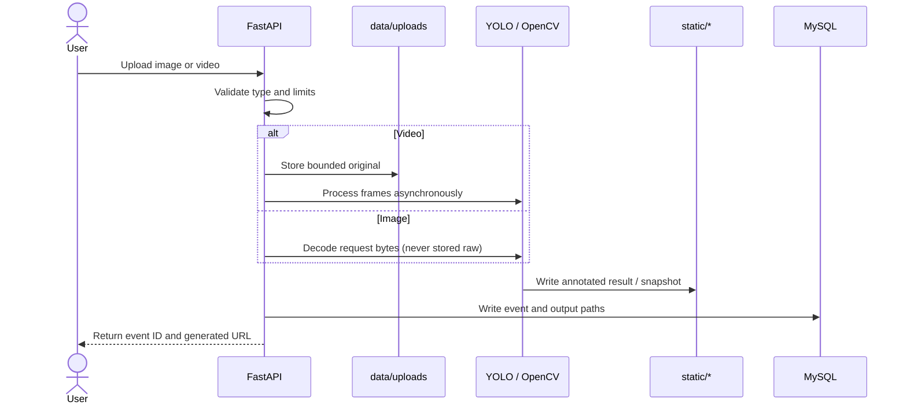

> [!NOTE]
> Uploaded **images** are decoded from the request bytes and only the annotated result is saved. Only **videos** are stored as originals in the private upload directory.

---

## 5. Frontend implementation

The frontend lives in `frontend/src`.

### Application shell

| Piece | Role |
| --- | --- |
| `main.jsx` | Mounts the React app and the authentication provider |
| `App.jsx` | Defines public routes and the authenticated `AppLayout` |
| `Navbar`, `Sidebar` | Wrap all signed-in pages |
| `AuthContext.jsx` | Owns login/logout state, current user, JWT token, and admin/operator helpers |
| `axiosClient.js` | The **shared** HTTP client — API modules in `src/api` use it instead of ad-hoc clients |

### Route map

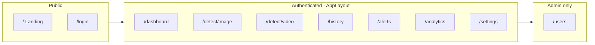

| URL | Page | Access |
| --- | --- | --- |
| `/` | Landing | Public |
| `/login` | Login | Public |
| `/dashboard` | Overview statistics | Authenticated |
| `/detect/image` | Image upload and result | Authenticated |
| `/detect/video` | Video upload and progress | Authenticated |
| `/history` | Detection history and details | Authenticated |
| `/alerts` | Alert and agent report center | Authenticated |
| `/analytics` | Charts and trends | Authenticated |
| `/settings` | User settings | Authenticated |
| `/users` | User administration | Admin only |

> [!NOTE]
> The frontend hides admin routes for convenience, but the **backend checks are the real security boundary**.

### Frontend request flow

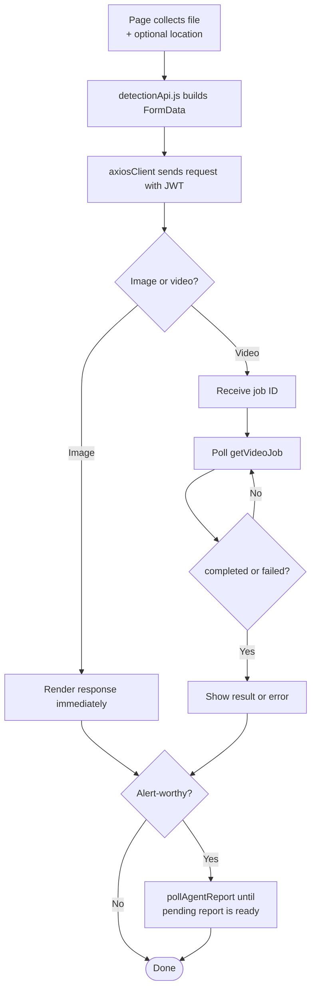

Shared components display severity, confidence, progress, delivery state, and errors.

---

## 6. Backend startup and structure

The backend lives in `backend/app`.

### Startup sequence

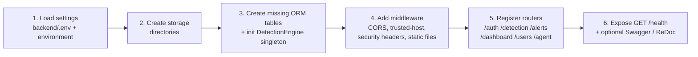

### Layered architecture

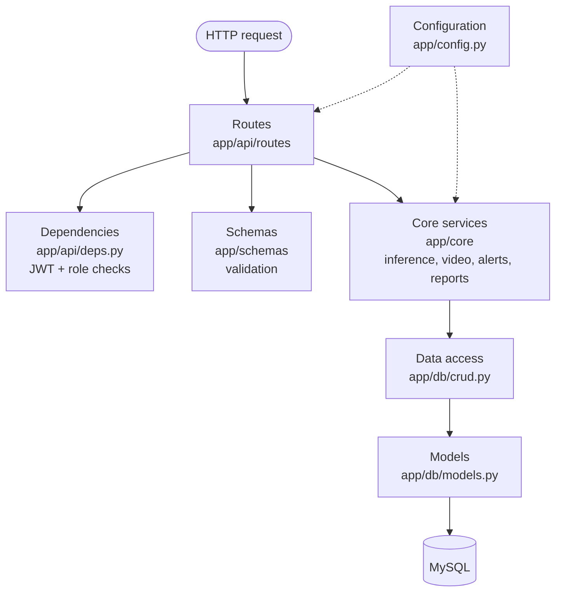

| Layer | Location | Responsibility |
| --- | --- | --- |
| Routes | `app/api/routes` | Parse requests, inject dependencies, authorize, return responses |
| Dependencies | `app/api/deps.py` | Decode JWTs, load active users, enforce admin role |
| Schemas | `app/schemas` | Validate and describe request/response data |
| Core services | `app/core` | Inference, video, alerts, reports, external services |
| Data access | `app/db/crud.py` | Query and mutate persistent records |
| Models | `app/db/models.py` | SQLAlchemy table and relationship definitions |
| Configuration | `app/config.py` | Typed environment settings and safe defaults |

---

## 7. Authentication and authorization

### Login flow

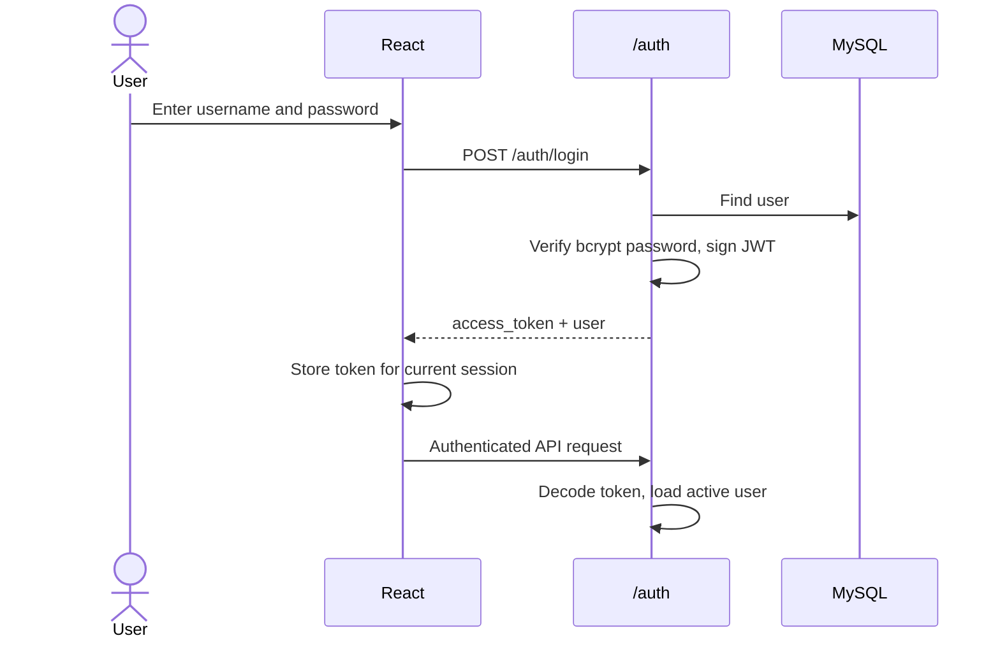

**Endpoints:** `POST /auth/register` · `POST /auth/login` · `GET /auth/me`

### Roles and permissions

Roles are `admin`, `operator`, and `viewer`. Non-admin event queries are **scoped to the requesting user's ID**.

| Capability | Admin | Operator / Viewer |
| --- | :---: | :---: |
| Sign in and read own profile | ✅ | ✅ |
| Use authenticated pages (detect, history, dashboard) | ✅ | ✅ |
| View **own** detection events | ✅ | ✅ |
| View **all** detection events | ✅ | ❌ |
| Delete detection events | ✅ | ❌ |
| Manage users (list, update, delete) | ✅ | ❌ |
| Test email, call, and WhatsApp notifications | ✅ | ❌ |

### Security boundary layers

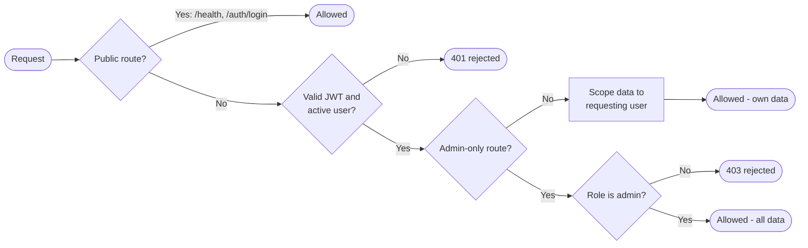

---

## 8. Image detection

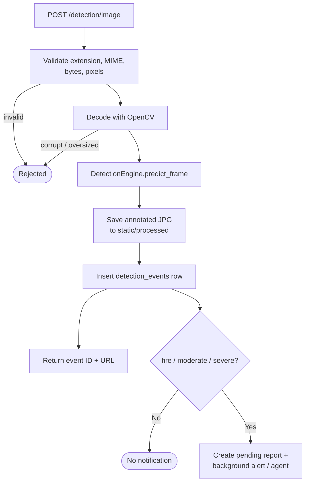

### Step by step

1. `detection.py` validates **JPG / JPEG / PNG / WebP** and the configured size and pixel limits.
2. OpenCV decodes the request bytes; corrupt or oversized images are rejected.
3. `DetectionEngine` runs the singleton Ultralytics YOLO model with the configured confidence, IoU, and image size.
4. Each detected box becomes a JSON object with **class, confidence, and coordinates**.
5. OpenCV draws the annotations and the result is written to `static/processed`.
6. `crud.create_detection_event` stores the event.
7. The API returns `event_id`, class, confidence, boxes, processed URL, processing time, and whether alert work was triggered.

> [!NOTE]
> **Fail-safe:** if the model file is absent or cannot run, the engine returns `no_detection` with an unannotated frame instead of crashing startup.

---

## 9. Video detection

### Processing sequence

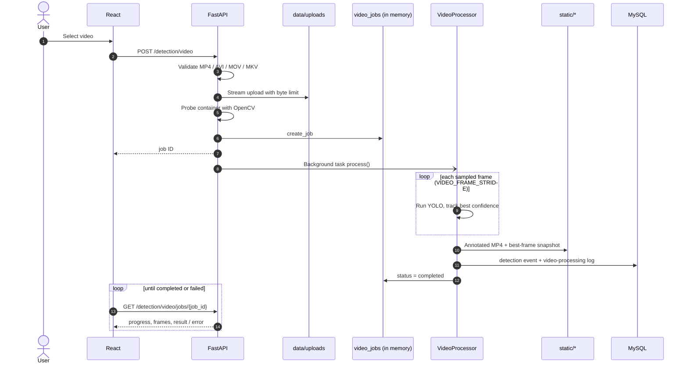

### Job lifecycle

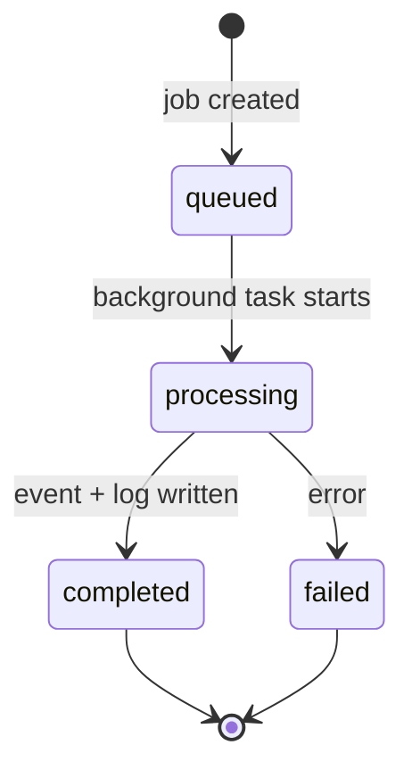

### Alert confirmation logic

A single noisy frame must not raise an alarm. An alert requires **`VIDEO_CONFIRMATION_FRAMES` consecutive** alert-worthy sampled frames.

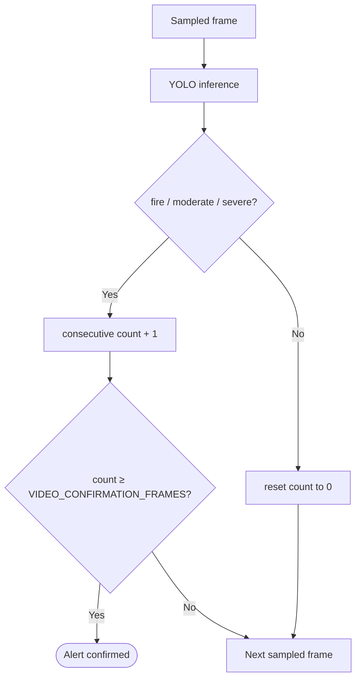

### Step by step

1. `POST /detection/video` validates **MP4 / AVI / MOV / MKV**.
2. The upload is **streamed** to `data/uploads` with a byte limit.
3. OpenCV probes the container **before** a job is created.
4. `video_jobs.create_job` stores an in-memory job record and the endpoint returns a job ID.
5. A FastAPI background task calls `VideoProcessor.process`.
6. The processor samples frames using `VIDEO_FRAME_STRIDE`, runs the same model, writes an annotated MP4, and keeps the best-confidence snapshot.
7. Alert confirmation applies (see above).
8. The job writes a detection event and video-processing log, then becomes `completed`.

### Polling response

```text
GET /detection/video/jobs/{job_id}
→ status:   queued | processing | completed | failed
→ fields:   progress, processed_frames, total_frames, result, error
```

> [!WARNING]
> The optional `/stream` endpoint exposes an MJPEG preview. It currently only checks that the job exists. It needs the **same JWT and ownership check** as the polling endpoint before production deployment.

---

## 10. Model and training artifacts

| Item | Location |
| --- | --- |
| Runtime inference | `backend/app/core/detection_engine.py` |
| Video orchestration | `backend/app/core/video_processor.py` |
| Deployed weights | `backend/ml_model/best.pt` |
| Notebooks, metrics, sample predictions, training output | `ml_training/accident_model_bundle/` |
| Training / validation / test data | `Dataset/` |

### Class contract

| Class ID | Name | Alert? |
| ---: | --- | :---: |
| 0 | 🔥 `fire` | ✅ Yes |
| 1 | 🟠 `moderate` | ✅ Yes |
| 2 | 🔴 `severe` | ✅ Yes |
| — | ⚪ `no_detection` | ❌ No |

> [!IMPORTANT]
> Class **order** is part of the contract between the trained weights and the API. Changing the model means verifying class IDs and running regression samples.

### Key model settings

| Setting | Effect |
| --- | --- |
| `MODEL_PATH` | Location of the YOLO weights |
| `DETECTION_CONFIDENCE` | Minimum confidence to keep a detection |
| `IOU_THRESHOLD` | Overlap threshold for suppressing duplicate boxes |
| `IMG_SIZE` | Inference image size |
| `VIDEO_FRAME_STRIDE` | Analyze every Nth frame of a video |
| `VIDEO_CONFIRMATION_FRAMES` | Consecutive alert-worthy frames required to confirm an alert |
| `MAX_VIDEO_FRAMES` | Upper bound on frames processed per video |

---

## 11. Database and persistence

The **ORM is authoritative** for runtime behavior. `database/init.sql` initializes a brand-new MySQL instance; Alembic migrations in `backend/alembic/versions` upgrade existing installations.

### Entity relationships

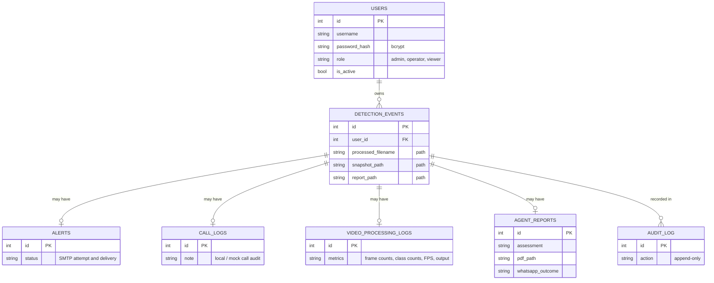

> [!NOTE]
> The diagram shows the relationships and the columns that are part of the storage contract. See `backend/app/db/models.py` for the complete column list.

### Tables

| Table | Purpose |
| --- | --- |
| `users` | Accounts, bcrypt hashes, roles, active state |
| `detection_events` | One image/video incident record |
| `alerts` | SMTP attempt and delivery status |
| `call_logs` | Local / mock call audit record |
| `video_processing_logs` | Frame counts, class counts, FPS, output |
| `agent_reports` | Assessment, PDF path, WhatsApp outcome |
| `audit_log` | Append-only system and operator actions |

An event owns optional alert, call, video, and agent-report records. Media is stored **by path**, never as blobs.

### Schema change workflow

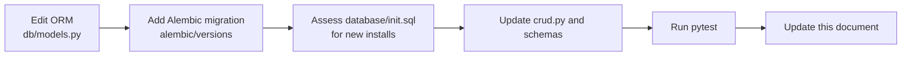

---

## 12. Emergency agent, reports, and notifications

Alert-worthy events (`fire`, `moderate`, `severe`) trigger background work. Every external integration is **optional** and degrades gracefully.

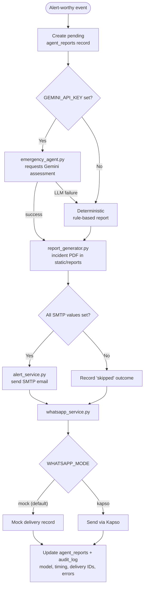

### Fail-safe behavior

| Situation | System behavior |
| --- | --- |
| YOLO model missing or fails | Returns `no_detection` with unannotated frame; startup continues |
| `GEMINI_API_KEY` missing | Deterministic rule-based report |
| Gemini call fails | Falls back to the rule-based report |
| SMTP values incomplete | Alert recorded as **skipped** |
| WhatsApp not configured for Kapso | Runs in **mock** mode |
| Any credential missing | UI shows a visible skipped / fallback state |

> [!IMPORTANT]
> Missing integration credentials must produce a **visible skipped/fallback state — never a false claim of delivery.**

---

## 13. API reference

### Authentication

| Method | Path | Access | Purpose |
| --- | --- | --- | --- |
| `POST` | `/auth/register` | Per deployment policy | Create an account |
| `POST` | `/auth/login` | Public | Obtain JWT and user |
| `GET` | `/auth/me` | Authenticated | Current user |

### Detection

| Method | Path | Access | Purpose |
| --- | --- | --- | --- |
| `POST` | `/detection/image` | Authenticated | Analyze an image |
| `POST` | `/detection/video` | Authenticated | Upload a video, receive a job ID |
| `GET` | `/detection/video/jobs/{job_id}` | Authenticated | Poll video job status |
| `GET` | `/stream` (video preview) | ⚠️ Needs auth hardening | Optional MJPEG preview |
| `GET` | `/detection/history` | Authenticated (owner-scoped) | List events |
| `GET` | `/detection/history/{id}` | Authenticated (owner-scoped) | Event details |
| `PATCH` | `/detection/history/{id}/status` | Authenticated | Change incident state |
| `DELETE` | `/detection/history/{id}` | **Admin** | Delete an event |

### Alerts

| Method | Path | Access | Purpose |
| --- | --- | --- | --- |
| `GET` | `/alerts` | Authenticated | Alert records |
| `GET` | `/alerts/calls` | Authenticated | Call audit records |
| `POST` | `/alerts/test-email` | **Admin** | Test SMTP delivery |
| `POST` | `/alerts/test-call` | **Admin** (mock) | Test call flow |

### Emergency agent

| Method | Path | Access | Purpose |
| --- | --- | --- | --- |
| `GET` | `/agent/status` | Authenticated | Agent and integration status |
| `GET` | `/agent/report/{detection_id}` | Authenticated | Report for one event |
| `GET` | `/agent/report/{detection_id}/pdf` | Authenticated | Download the incident PDF |
| `GET` | `/agent/reports` | Authenticated | List reports |
| `POST` | `/agent/test-whatsapp` | **Admin** | Test WhatsApp delivery |

### Dashboard

| Method | Path | Purpose |
| --- | --- | --- |
| `GET` | `/dashboard/stats` | Headline totals |
| `GET` | `/dashboard/timeline` | Time-based event data |
| `GET` | `/dashboard/confidence-distribution` | Confidence buckets |

### Users (admin only)

| Method | Path | Purpose |
| --- | --- | --- |
| `GET` | `/users` | List users |
| `PUT` | `/users/{id}` | Update a user |
| `DELETE` | `/users/{id}` | Delete a user |

### System

| Method | Path | Purpose |
| --- | --- | --- |
| `GET` | `/health` | Liveness check |
| `GET` | `/static/...` | Generated media (processed, snapshots, reports) |
| — | Swagger / ReDoc | Optional interactive API documentation |

---

## 14. Docker deployment, volumes, and mounts

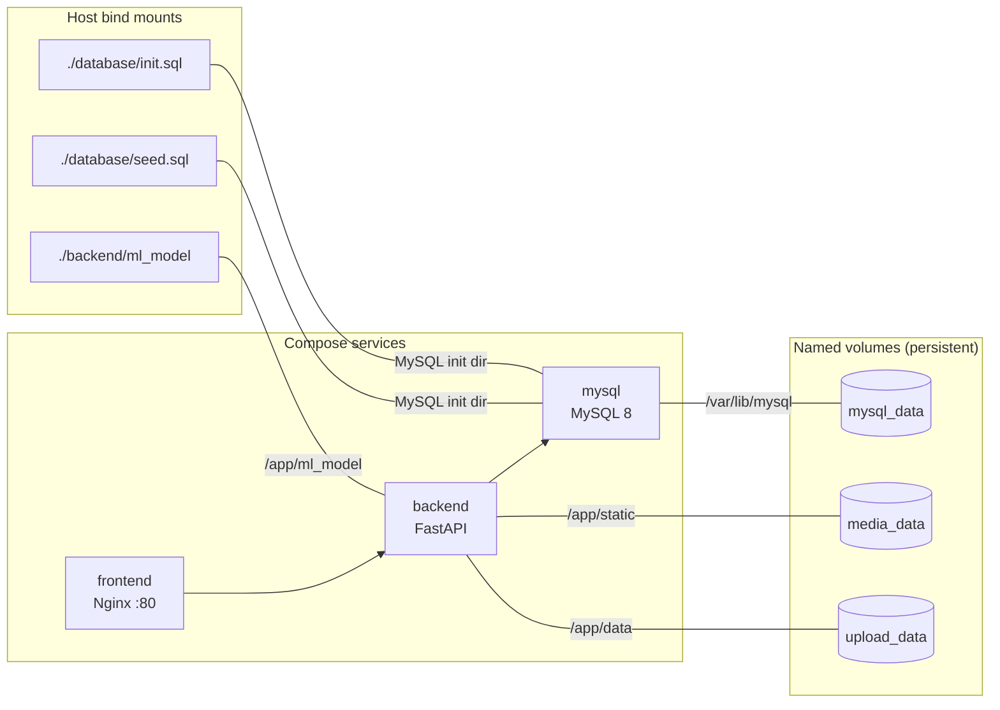

| Compose mount | Container path | Reason |
| --- | --- | --- |
| `mysql_data` | `/var/lib/mysql` | Durable database data |
| `media_data` | `/app/static` | Generated images, videos, reports |
| `upload_data` | `/app/data` | Private original uploads |
| `./backend/ml_model` | `/app/ml_model` | Runtime model weights from host |
| `./database/init.sql` | MySQL init directory | First database bootstrap |
| `./database/seed.sql` | MySQL init directory | Safe empty/demo seed script |

### Stopping the stack safely

| Command | Effect on data |
| --- | --- |
| `docker compose down` | ✅ Stops containers; **named volumes are kept** |
| `docker compose down -v` | ❌ **Destructive** — deletes database **and** media volumes (local runtime data is lost) |

---

## 15. Configuration

Core settings are defined in `backend/app/config.py`. Compose supplies database credentials and deployment overrides; `backend/.env` supplies application and integration values. **Keep these two files separate.**

| Group | Variables |
| --- | --- |
| **Database / security** | `DATABASE_URL`, `SECRET_KEY`, `ALGORITHM`, token expiry, CORS, trusted hosts |
| **Model** | `MODEL_PATH`, `DETECTION_CONFIDENCE`, `IOU_THRESHOLD`, `IMG_SIZE` |
| **Video / files** | Upload directory, processed directories, upload / pixel / frame limits, accepted types, `VIDEO_FRAME_STRIDE`, `VIDEO_CONFIRMATION_FRAMES`, `MAX_VIDEO_FRAMES` |
| **Email** | `SMTP_HOST`, `SMTP_PORT`, `SMTP_USER`, `SMTP_PASSWORD`, `ALERT_EMAIL_TO` |
| **Agent** | `GEMINI_API_KEY`, `GEMINI_MODEL`, `AGENT_ENABLED`, timeout |
| **WhatsApp** | `WHATSAPP_MODE`, `WHATSAPP_ENABLED`, Kapso IDs / keys, media URL settings |

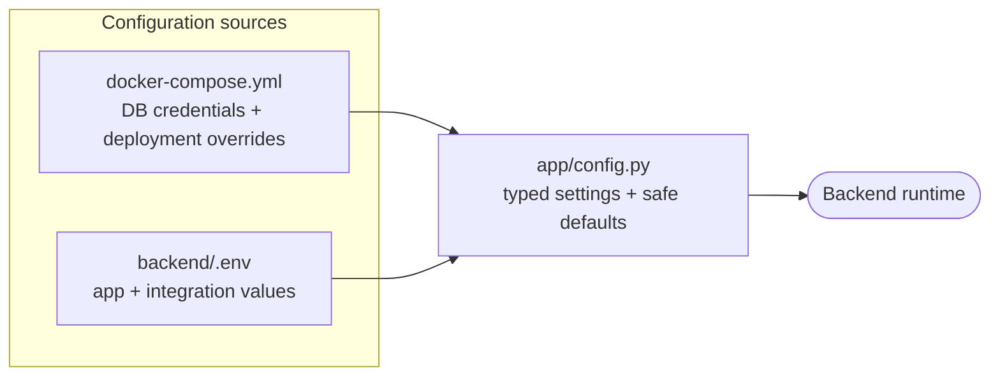

---

## 16. Security and what must never be committed

### Never commit

| ❌ Item | Why |
| --- | --- |
| Root `.env` and `backend/.env` | Contain all secrets |
| Passwords, JWT secrets, SMTP app passwords, Gemini / Kapso keys | Credentials |
| Real emergency phone numbers or recipient addresses | Personal data |
| Unreviewed personal incident media | Privacy |
| Temporary uploads and generated runtime files | Runtime data, not source |
| Python virtual environments, `node_modules`, caches, local build output | Reproducible / bulky |

> [!TIP]
> `.gitignore` is the first line of defense — but **always check `git status` before committing.**

### Security controls in place

| Control | Where |
| --- | --- |
| bcrypt password hashing | `/auth` |
| Signed JWTs, active-user check | `deps.py` |
| Admin role enforcement on the **server** | `deps.py` |
| Per-user scoping of event queries | routes + `crud.py` |
| Upload validation: extension, MIME, bytes, pixels, frame limits | detection routes |
| CORS, trusted-host, and security-header middleware | `main.py` |
| Private upload directory outside `/static` | file-system design |
| Append-only audit log | `audit_log` table |

---

## 17. Testing and development workflow

Backend tests run against an **isolated SQLite database** and **disable the external agent**, so no real emails, WhatsApp messages, or LLM calls are made.

```bash
# Backend
cd backend
pytest -q

# Frontend
cd frontend
npm run lint
npm run build
```

### What to inspect for each kind of change

| Change | Check together |
| --- | --- |
| **Backend feature** | Route → core service → CRUD / model code → relevant tests |
| **Schema change** | Update ORM → add Alembic migration → assess `database/init.sql` |
| **Model change** | Verify class order → run regression samples → update class metadata |
| **Storage change** | Ignore rules → Docker volume behavior → DB path fields → this document |
| **New integration** | Config variables → fallback / skipped state → tests with the agent disabled |

---

## 18. Adding a new file or directory

```mermaid
flowchart TD
    S(["New file or directory"]) --> Q{"What is it?"}
    Q -->|"Source code"| A["backend/app or frontend/src<br/>COMMIT"]
    Q -->|"DB migration"| B["backend/alembic/versions<br/>COMMIT"]
    Q -->|"Model artifact"| C["backend/ml_model<br/>COMMIT only if approved"]
    Q -->|"Documentation"| D["docs/<br/>COMMIT"]
    Q -->|"Runtime data"| E["Never beside source files"]
    E --> E1["Add / confirm .gitignore rule"]
    E1 --> E2["Confirm Docker volume behavior"]
    E2 --> E3{"Persisted artifact?"}
    E3 -->|"Yes"| E4["Add DB path field<br/>+ cleanup policy"]
    E3 -->|"No"| Z
    E4 --> Z
    A --> Z
    B --> Z
    C --> Z
    D --> Z
    Z["Update docs/system.md<br/>if the storage contract changed"]
```

1. Decide whether it is **source, a migration, a model artifact, runtime data, or documentation**.
2. Put it under the matching boundary above; **do not place uploads beside source files**.
3. If it is runtime data, add or confirm its ignore rule and Docker volume behavior.
4. If it is a persisted artifact, add the database path field and a cleanup policy.
5. Update this document when the storage contract changes.

---

## 19. Known limitations and production roadmap

| # | Limitation | Risk | Recommended next step |
| :-: | --- | :---: | --- |
| 1 | The video MJPEG `/stream` endpoint lacks JWT and ownership checks | 🔴 High | Apply the same auth and ownership dependency as the job-polling endpoint |
| 2 | Live emergency delivery has not had a security / privacy review | 🔴 High | Review HTTPS, recipient consent, and provider policy before live use |
| 3 | Video jobs are process-local and lost on restart | 🟠 Medium | Move to a durable worker / queue for multi-worker deployment |
| 4 | Generated media has no retention or deletion policy | 🟠 Medium | Define retention, authentication for `/static`, and deletion jobs |
| 5 | Frontend session restoration and token / cookie policy unreviewed | 🟠 Medium | Review before deployment |
| 6 | Model quality depends on training data | 🟡 Ongoing | Build repeatable regression / evaluation samples |

```mermaid
flowchart LR
    N["Current state<br/>working prototype"] --> H["1. Harden<br/>auth on /stream<br/>HTTPS + token policy"]
    H --> D["2. Make durable<br/>job queue / workers<br/>survive restarts"]
    D --> G["3. Govern data<br/>media retention<br/>access policy"]
    G --> Q["4. Measure quality<br/>regression + evaluation<br/>sample sets"]
    Q --> P(["Production-ready"])
```

### Pre-deployment checklist

- [ ] `/stream` protected with JWT and ownership checks
- [ ] HTTPS enabled end to end
- [ ] Secrets provided via environment, none committed (`git status` clean of `.env`)
- [ ] `SECRET_KEY`, database, and SMTP credentials rotated from development values
- [ ] Media retention and deletion policy defined and implemented
- [ ] `/static` access policy decided (authenticated vs. public)
- [ ] Durable video worker / queue in place
- [ ] Recipient consent and provider policy reviewed for live notifications
- [ ] Model evaluated against regression samples
- [ ] Session / token storage policy reviewed
- [ ] `pytest -q`, `npm run lint`, and `npm run build` all pass

---

## 20. Glossary

| Term | Meaning |
| --- | --- |
| **YOLO** | "You Only Look Once" — the real-time object-detection model family used for inference |
| **IoU** | Intersection over Union — overlap measure used to discard duplicate boxes |
| **JWT** | JSON Web Token — the signed token that authenticates API requests |
| **MJPEG** | Motion JPEG — a simple streaming format used for the video preview |
| **Alembic** | Database migration tool that upgrades existing schemas |
| **ORM** | Object-relational mapper (SQLAlchemy) — the authoritative schema at runtime |
| **Kapso** | The provider used for live WhatsApp delivery |
| **Agent report** | The assessment + PDF + delivery outcome generated for an alert-worthy event |
| **Alert-worthy** | A detection of class `fire`, `moderate`, or `severe` |
| **Named volume** | A Docker-managed persistent storage location that survives `docker compose down` |

---

<sub>Single source of truth for the system design and file-system contract. Update it whenever routes, storage boundaries, or the data model change. Setup instructions live in the root [README.md](../README.md).</sub>
